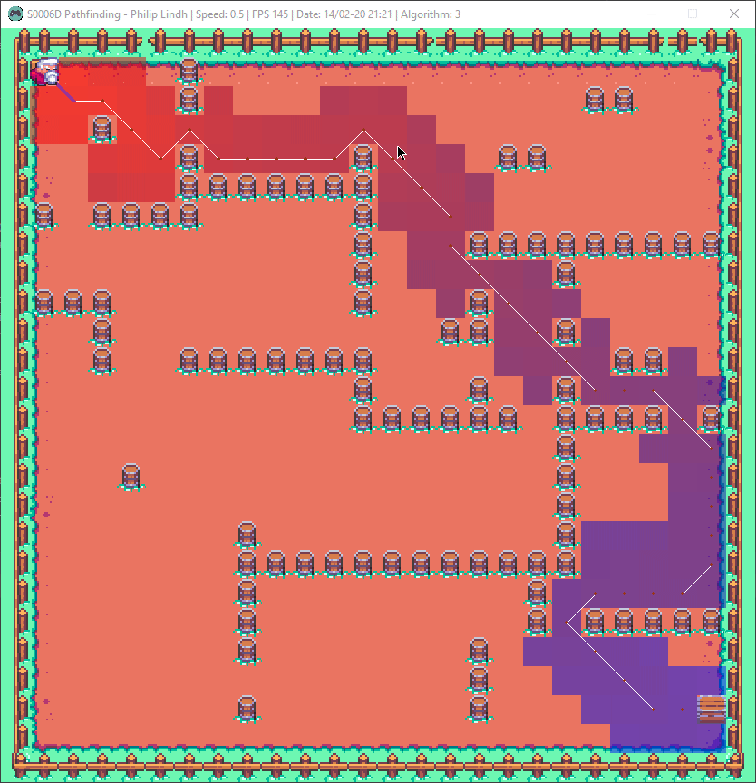

# S0006D-Laboration-2 - Pathfinding (A*, DFS, BFS)

CONTROLS
* Mouse Left Click = Set Starting Point
* Mouse Right Click = Set End Point
* Mouse Middle Click = Add/Remove Obstacles
* Mouse Scroll = Change algorithm 
* Number 1-3 navigates active level (4 is currently broken, the map from laboration 1)

MISC
* Esc = Exit
* Alt = Toggle mouse accessability
* Left Shift = Increases speed by x2 
* Left Ctrl  = Decreases speed by x2
* Spacebar = Pauses the entire game clock 
